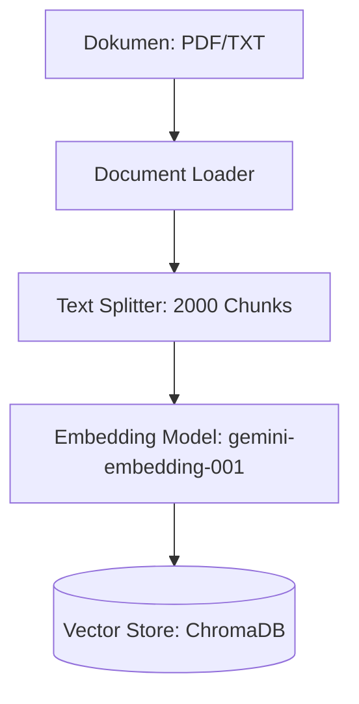
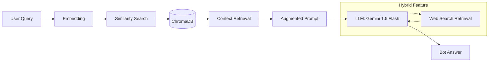

# Arsitektur Sistem CACO RAG 🎓

Sistem ini terdiri dari dua pipeline utama: Indexing (Offline) dan Query (Online).

## 1. Pipeline Indexing (Offline)
Pipeline ini bertanggung jawab untuk memproses dokumen sumber dan menyimpannya ke dalam Vector Database.

## 2. Pipeline Query (Online)
Pipeline ini menangani pertanyaan pengguna dengan menggabungkan konteks dokumen dan kemampuan LLM.

## Komponen Utama
- **Framework**: LangChain
- **LLM**: Google Gemini 1.5 Flash
- **Vector DB**: ChromaDB
- **Embedding**: Google Generative AI Embeddings
- **Interface**: Streamlit
